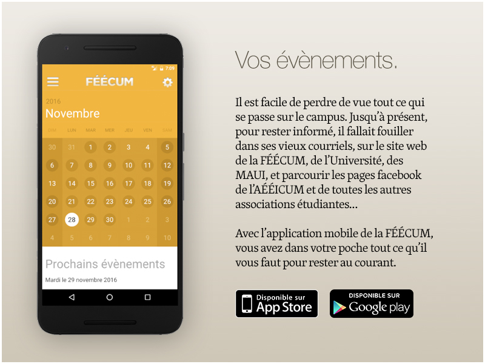
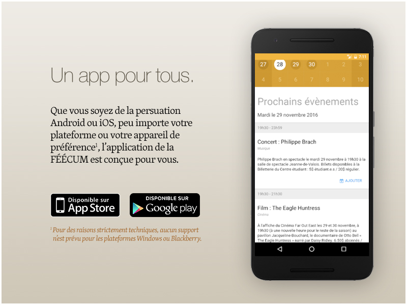
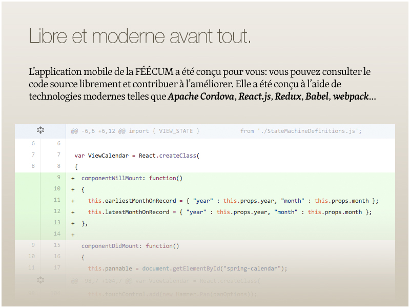
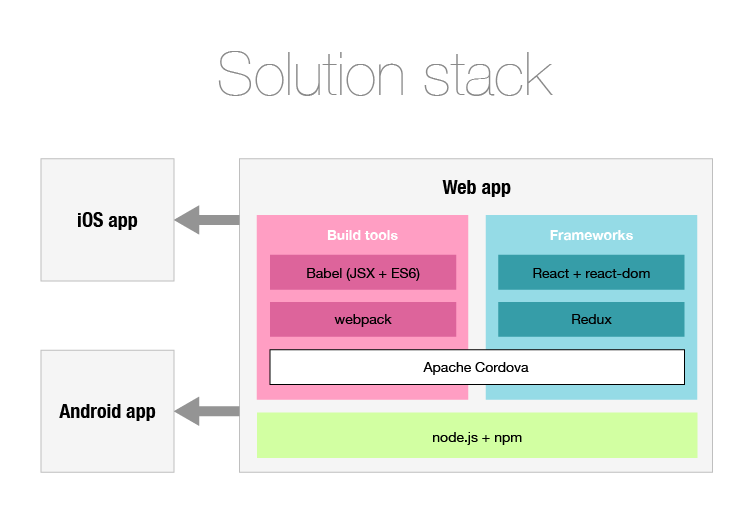

Qu'est-ce que l'application mobile de la FÉÉCUM?
=======================

L'application mobile de la FÉÉCUM sera bientôt disponible pour les plateformes mobiles iOS et Android. Elle vous permettra d'accéder directement au calendrier d'événements de la FÉÉCUM, et vous donnera la possibilité de sauvegarder des événements à votre calendrier de téléphone: oublier un événement important sera bientôt chose du passé, avec toutes les fonctionnalités de votre téléphone mobile intégré (rappels avant l'événement, push notifications, alarmes, etc.).







Pour plus d'information sur l'application mobile de la FÉÉCUM, veuillez lire
**[cet article paru dans Le Front le 29 mars 2016](http://lefront.ca/app-feecum-vie-etudiante-a-portee-de-main/)**.


Table des matières
=======================

<ol>
  <li>
    <a href="#todo">
      TODO
    </a>
  </li>
  <li>
    <a href="#dependencies">
      Dependencies
    </a>
    <ol>
      <li>
        <a href="#basic-environment-setup">
          Basic environment setup
        </a>
      </li>
      <li>
        <a href="#for-ios">
          For iOS
        </a>
      </li>
      <li>
        <a href="#for-android">
          For Android
        </a>
      </li>
    </ol>
  </li>
  <li>
    <a href="#updating">
      Updating
    </a>
  </li>
  <li>
    <a href="#deployment">
      Deployment
    </a>
  </li>
  <li>
    <a href="#debugging">
      Debugging
    </a>
  </li>
</ol>


TODO
=======================
* Implement [flow](https://flowtype.org/)
* Implement [React Performance Tools](https://facebook.github.io/react/docs/perf.html)


Dependencies
=======================



Dependencies and their instructions are subject to change. These are provided as a rough guide.


Basic environment setup
-----------------------

The first step is to install [node.js](http://nodejs.org/) (it comes with npm, required for the rest of the setup).

Installing [Apache Cordova](https://cordova.apache.org/):
```
$ npm install -g cordova
```

Installing [Babel](https://babeljs.io/) and the [ES2015 object rest spread syntax plugin](https://babeljs.io/docs/plugins/syntax-object-rest-spread/):
```
$ npm install --global babel-cli
$ npm install babel-plugin-syntax-object-rest-spread
```

Installing [webpack](https://webpack.github.io/):
```
$ npm install webpack -S
```

Installing the [babel-loader plugin for webpack](https://github.com/babel/babel-loader):
```
$ npm install babel-loader babel-core babel-preset-es2015 --save-dev
```

Installing the [react and react-dom plugins for webpack](https://facebook.github.io/react/):
```
$ npm install react react-dom -S
```

Installing [Redux](http://redux.js.org/), the [React bindings](https://github.com/reactjs/react-redux) and the [Redux developer tools](https://github.com/gaearon/redux-devtools):
```
$ npm install --save redux
$ npm install --save react-redux
$ npm install --save-dev redux-devtools
```

Installing [cordova-plugin-calendar](https://www.npmjs.com/package/cordova-plugin-calendar):
```
$ cordova plugin add cordova-plugin-calendar
```


For iOS
-----------------------

* [Xcode](https://developer.apple.com/xcode/)
* Xcode Command Line Tools
* [ios-sim](https://www.npmjs.com/package/ios-sim)
* [ios-deploy](https://www.npmjs.com/package/ios-deploy)

Installing Xcode Command Line Tools:
```
$ xcode-select --install
```

Installing ios-sim and ios-deploy (requires npm):
```
$ npm install -g ios-sim
$ npm install -g ios-deploy
```

If ios-deploy fails to install on El Capitan, try:
```
$ npm install --global --unsafe-perm=true ios-deploy
```


For Android
-----------------------

* [JDK](http://www.oracle.com/technetwork/java/javase/downloads/index.html)
* [Android Studio](https://developer.android.com/studio/index.html)
* [Gradle](https://gradle.org/)


Updating
=======================

Update instructions are subject to change, but should be relatively stable.

Update Apache Cordova CLI:
```
$ sudo npm update -g cordova
```

Check for platform updates (note: this doesn't seem to behave properly on my setup):
```
$ cordova platform check
```

Update platforms (example):
```
$ cordova platform update android
$ cordova platform update ios
```


Deployment
=======================

Deployment instructions are stable.

To build the application:
```
$ npm run build            // run webpack in production mode (minimize automatically)
$ npm run dev              // run webpack in watch mode (auto-bundles whenever files change)
$ npm run browser          // equivalent to `npm run dev && cordova run browser`
```

To deploy and launch in the browser:
```
$ cordova run browser      // will launch in default browser
$ cordova run browser --target=Chrome
$ cordova run browser --target=Safari
$ cordova run browser --target=Firefox
```

To deploy and launch on Android:

```
$ cordova build android
$ cordova run android --emulator
$ cordova run android --device
```

To deploy and launch on iOS simulator:

```
$ cordova build ios
$ cordova run ios --emulator
```

To find out what simulator images are available:

```
$ cordova emulate ios --list

Available iOS Virtual Devices:
    iPhone-4s, 9.3
    iPhone-5, 9.3
    iPhone-5s, 9.3
    iPhone-6, 9.3
    iPhone-6-Plus, 9.3
    iPhone-6s, 9.3
    iPhone-6s-Plus, 9.3
    iPad-2, 9.3
    iPad-Retina, 9.3
    iPad-Air, 9.3
    iPad-Air-2, 9.3
    iPad-Pro, 9.3
```

Then use one of the simulator names in the `--target` parameter:

```
$ cordova emulate ios --target="iPhone-4s, 9.3"
$ cordova emulate ios --target="iPad-Air-2, 9.3"
$ cordova emulate ios --target="iPhone-6s, 9.3"
$ cordova emulate ios --target="iPhone-6-Plus, 9.3"
```


Debugging
=======================

### JavaScript debugging
* Make sure code is being processed by the [webpack loader](https://webpack.github.io/docs/loaders.html).
* Make sure [Babel](http://babeljs.io/) is working fine.
* Install and use the [React Developer Tools](https://github.com/facebook/react-devtools)
* TODO: implement [flow](https://flowtype.org/)

### iOS debugging
* Enable [Remote Debugging with Safari Developer Tools](https://developer.apple.com/safari/tools/).
* See [Debugging with Xcode](https://developer.apple.com/support/debugging/).

### Android debugging
* See [Debugging with Android Studio](https://developer.android.com/studio/debug/index.html).
* See [Remote Debugging Android Devices](https://developers.google.com/web/tools/chrome-devtools/remote-debugging/).
Note that Remote Debugging only works since Android 4.4.


Troubleshooting
-----------------------

There is a known issue where [Redux stores will not work properly if more than one version of the React module is loaded](https://medium.com/@dan_abramov/two-weird-tricks-that-fix-react-7cf9bbdef375#.s4sbzx3jk). If this becomes an issue, try running [npm dedupe](https://docs.npmjs.com/cli/dedupe):

```
$ npm dedupe
```

If there are issues attaching to the Android device, check to make sure
that you don't have the Chrome Developer Tools open to a device inspector.
Remote Debugging of Android devices is only supported since Android 4.4. To
troubleshoot Android device attachment issues, try:
```
$ adb kill-server
$ adb start-server
$ adb devices
```

If `cordova build android` complains about Gradle after you update Android Studio,
try updating the cordova android platform. This might downgrade Gradle to an
earlier version, but it will make the bitchin' stop:
```
$ cordova platform update android
```


